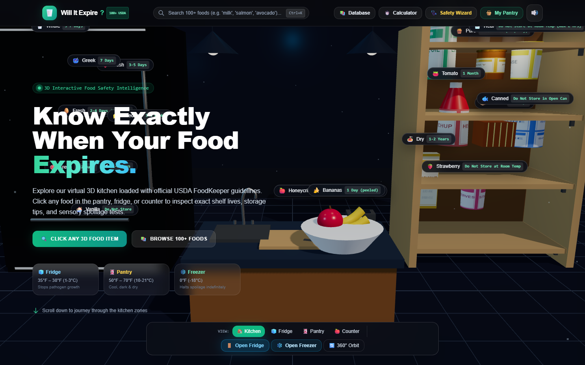
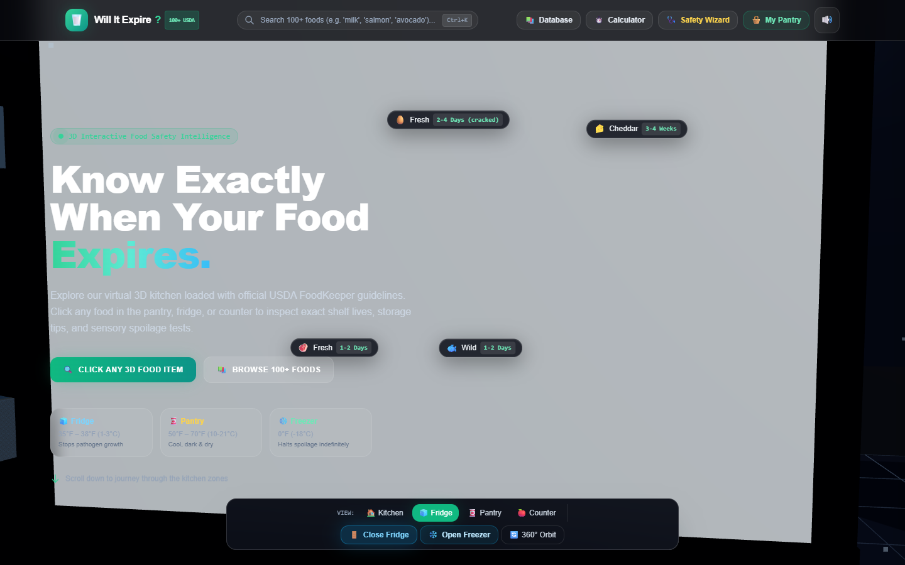
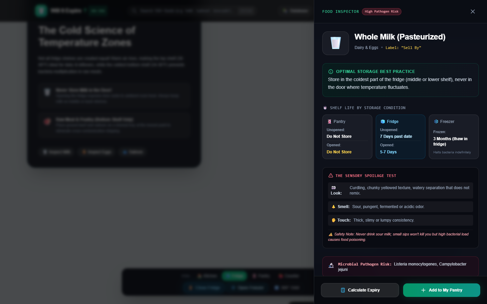
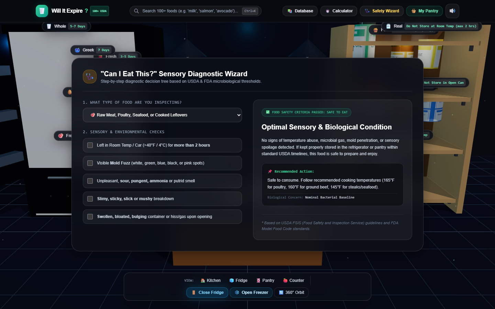
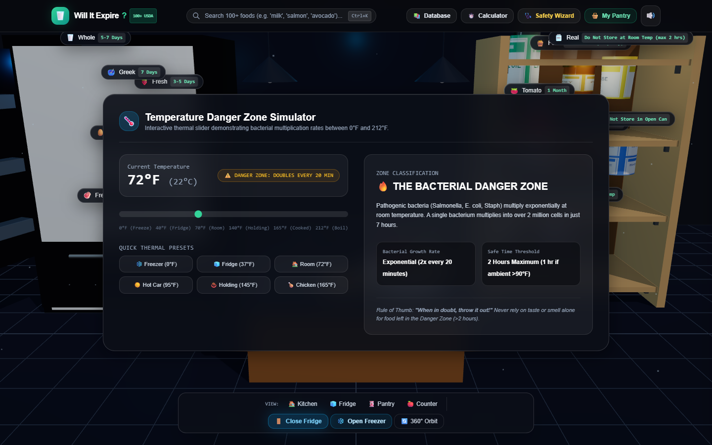
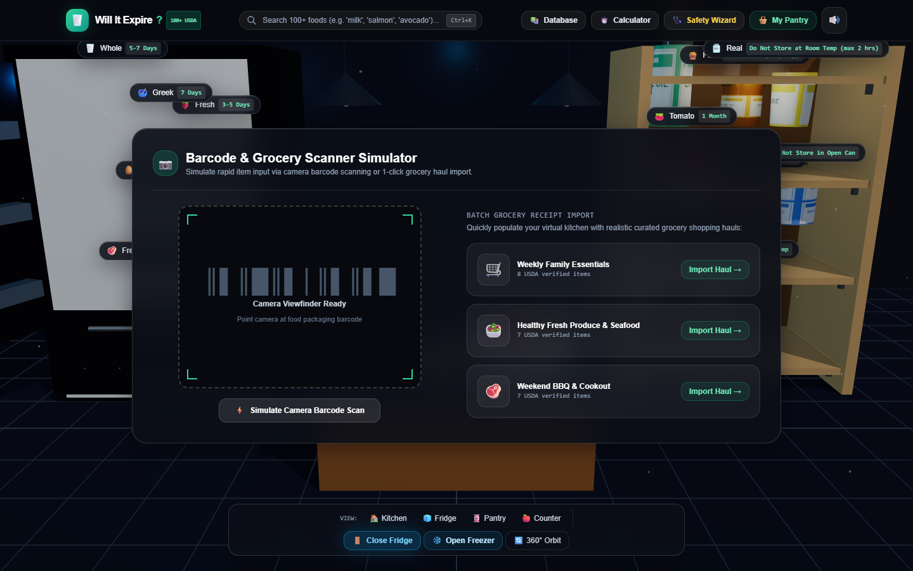
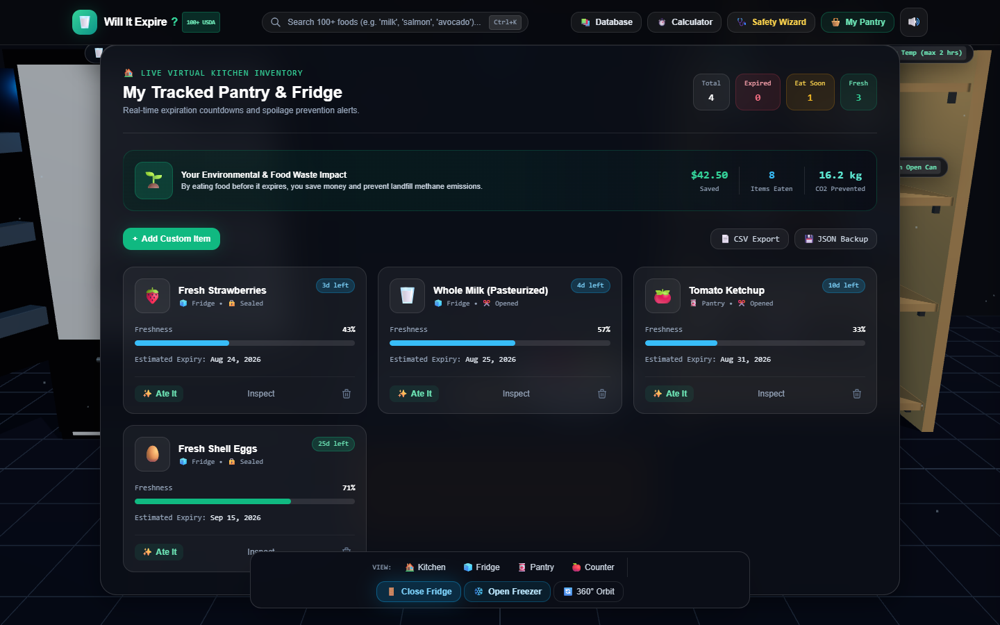

# 🥛 Will It Expire? — 3D Interactive Food Freshness & Storage Intelligence

> **A modern 3D WebGL kitchen environment powered by USDA FoodKeeper data to help you know exactly when food expires, prevent foodborne illness, and track household food waste reduction.**

[](https://will-it-expire.vercel.app/)

[](https://vitejs.dev/)
[](https://threejs.org/)
[](https://greensock.com/)
[](https://tailwindcss.com/)
[](LICENSE)

---

## 🌐 Live Production URL
### 👉 **[https://will-it-expire.vercel.app/](https://will-it-expire.vercel.app/)**

---

## 🎬 Application Demo Video & Screen Recording

https://github.com/user-attachments/assets/demo_screenrecording.webm

> *Watch the video recording above or check `docs/media/demo_screenrecording.webm` for a live walkthrough of the 3D kitchen, animated refrigerator doors, sensory safety wizard, and pantry tracking.*

---

## 📸 Visual Showcase & Feature Highlights

### 1. 🏠 3D Interactive Kitchen & Animated Refrigerator
Explore an interactive 3D kitchen with realistic materials, subway backsplash, marble prep countertop, and hanging pendant lamps. Click to **open and close the refrigerator doors** (with condiment door bins) or slide the **bottom freezer drawer**!


*Figure 1: Full 3D Kitchen Overview with zone navigators and 360° Orbit Mode.*


*Figure 2: Animated Refrigerator Door open at 110° revealing interior shelves, door racks, and cool LED lighting.*

---

### 2. 🔬 Deep Food Inspector & USDA Spoilage Guide
Click any food item in the 3D scene or search the database to open the Inspector Drawer with scientific shelf lives, **sensory spoilage checklists (Look / Smell / Touch)**, and microbial pathogen profiles (*Listeria*, *Salmonella*, *E. coli*, *Botulinum*).


*Figure 3: Whole Milk inspection drawer showing optimal storage, shelf life grid, and microbiological risks.*

---

### 3. 🩺 "Can I Eat This?" Sensory Diagnostic Decision Tree
An interactive step-by-step diagnostic tool that evaluates room temperature exposure time (>2 hrs in the Danger Zone), visible mold fuzz, sour/ammonia odors, slime, and bloated cans to give instant FDA/USDA-backed safety verdicts.


*Figure 4: Sensory Diagnostic Decision Tree with real-time risk assessment.*

---

### 4. 🌡️ Temperature Danger Zone Simulator
Interactive thermal slider (0°F to 212°F / -18°C to 100°C) with real-time bacterial growth doubling rates and quick presets (*Deep Freeze*, *Safe Refrigerator*, *Danger Zone*, *Hot Holding*, *Cooking Kill Temp*).


*Figure 5: Real-time bacterial multiplication rate indicator across thermal boundaries.*

---

### 5. 📷 Barcode Scanner & Batch Grocery Haul Importer
Simulated barcode viewfinder with animated laser line and 1-click batch haul presets (*Weekly Family Essentials*, *Healthy Produce & Seafood*, *Weekend BBQ*) to populate your inventory instantly.


*Figure 6: Barcode scanner simulation with 1-click grocery haul importer.*

---

### 6. 🧺 Live Virtual Pantry & Food Waste / CO2 Tracker
Track your food inventory in real-time with color-coded freshness progress bars, expiration countdowns, **CSV/JSON export**, custom food item creation, and environmental impact metrics (dollars saved & kg of CO2 emissions prevented).


*Figure 7: Virtual Kitchen Inventory with real-time freshness countdowns and savings tracker.*

---

## 🛠️ Tech Stack & Engineering Craft

- **3D Engine**: [Three.js](https://threejs.org/) (WebGL PBR standard materials, soft shadow maps, procedural canvas textures, OrbitControls damping).
- **Animation & Cameras**: [GSAP](https://greensock.com/) + [ScrollTrigger](https://greensock.com/scrolltrigger/) for conflict-free section transitions.
- **Styling**: [Tailwind CSS](https://tailwindcss.com/) with custom dark obsidian palette and glassmorphism.
- **Audio Synthesis**: Native **Web Audio API** procedural sound generator (magnetic door suction, latch thud, drawer slide, hover ticks).
- **Data Engine**: 100+ USDA FoodKeeper database with multi-field search and freshness calculations.
- **Build Tool**: [Vite](https://vitejs.dev/) with instantaneous HMR and optimized production bundling.

---

## 🚀 Quick Start & Local Setup

### Prerequisites
- [Node.js](https://nodejs.org/) (v18 or higher recommended)
- `npm` or `yarn` / `pnpm`

### 1. Clone the Repository
```bash
git clone https://github.com/ik123a/Will-It-Expire.git
cd Will-It-Expire
```

### 2. Install Dependencies
```bash
npm install
```

### 3. Start Development Server
```bash
npm run dev
```
Open your browser and navigate to **`http://localhost:3000/`**.

### 4. Build for Production
```bash
npm run build
```
The optimized production build will be generated in the `dist/` directory.

---

## 📚 Authoritative References & Data Sources

- **USDA FSIS**: [Food Safety and Inspection Service](https://www.fsis.usda.gov/)
- **USDA FoodKeeper Database**: [FoodKeeper App & Data](https://www.foodsafety.gov/keep-food-safe/foodkeeper-app)
- **U.S. FDA**: [Food Guidance & Regulations](https://www.fda.gov/food)
- **Cornell University**: Department of Food Science Shelf-Life Studies

---

## 📄 License
This project is licensed under the **MIT License** — see the [LICENSE](LICENSE) file for details.
